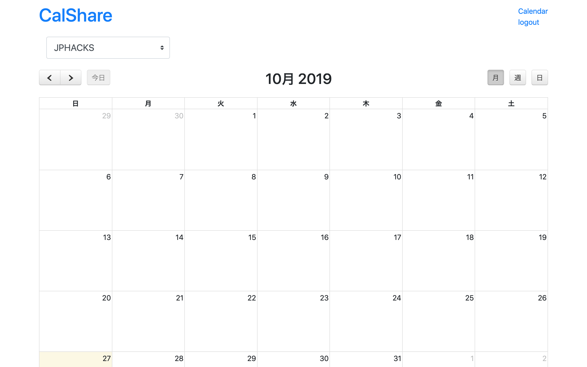

# CalShare

## 製品概要
### 日程調整 Tech

### 背景（製品開発のきっかけ、課題等）
- 普段使っている日程調整のアプリが使いづらい（手間が多い）
- みんなオンラインのカレンダーを使っているからそれをシェアすれば良い

### 製品説明（具体的な製品の説明）
カレンダーを表示して日程調整ができるアプリ

### 特長
#### 1. 特長1
日程の確認ができる
#### 2. 特長2
カレンダーの表示を年，月，日の3つに切り替えることができる
### 解決出来ること
スケジュールを組みやすくなる
### 今後の展望
Googleアカウント認証はできたが，Googleカレンダーを取得することができなかったため，カレンダーの取得や，フォームを作成してスケジュールの編集までできるようにしたい．

## 開発内容・開発技術
### 活用した技術
#### API・データ
* Google Calendar API

#### フレームワーク・ライブラリ・モジュール
* Rails6
    * fullcalendar

### 研究内容・事前開発プロダクト（任意）

### 独自開発技術（Hack Dayで開発したもの）
#### 2日間に開発した独自の機能・技術
* 独自で開発したものの内容をこちらに記載してください

* 特に力を入れた部分をファイルリンク、またはcommit_idを記載してください（任意）
    * Google認証機能を追加した部分のcommit_id
      * 6351784cd536d575fc49f9135ca7509f95f34336
